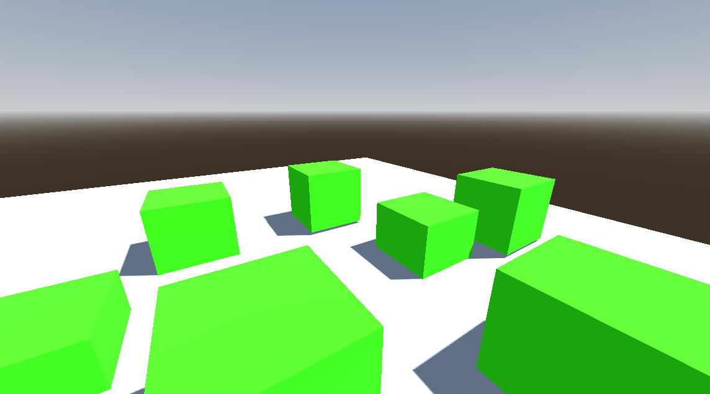

# Godot-FPS-Controller-Template

This is a template for a FPS controller made with Godot. It is designed to be easy to use and modify.

This template comes with levels to test the controller, well documented code, and test levels.

